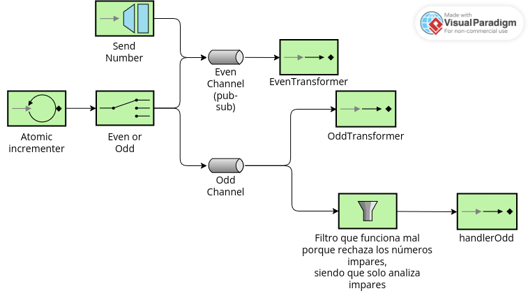

# Lab 5 Integration and SOA - Project Report

## 1. EIP Diagram (Before)

The starter code has some issues reflected in the diagram above:
- There is no number channel as it is supposed to be.
- Even channel is declared as Pub-Sub even though it shouldn't, and odd channel, which should be Pub-Sub, is not declared as so.
- Odd numbers are filtered twice, one by the dedicated flow and once again by the odd flow, which is in fact also incorrect, putting up some unexpected behaviours.
- Negative numbers are being fed directly to the even channel. This is not correct because they should be fed to the non existing number channel.
- There is a discard flow which is never used.

---

## 2. What Was Wrong

Explain the bugs you found in the starter code:

- **Bug 1**: Sometimes, odd numbers are rejected by the odd flow. This happens because the odd channel feeds a workflow which filters numbers to accept even numbers and reject odd numbers, which is wrong because at this point there is only odd numbers, there is no need for a filter. This bug was solved by directly routing numbers through their designated channels and removing these filters.
- **Bug 2**: Also related to odd numbers, sometimes it worked properly but not fully, because the number would reach the 'Service Activator' and correctly process the odd number, but the other workflow would never be activated. This was due to a mistake in the code in which the even channel was declared as Pub-Sub (even though it is not) and odd channel was not. It was fixed by changing the declaration to make the odd channel Pub-Sub.
- **Bug 3**: Negative numbers are always sent to the even channel, no matter if they are even or odd. This is because the gateway requests to feed the even channel instead of a common number channel (as seen in the diagram above as the current, wrong version, and in docs/EIP.png for the right version). This was fixed by changing the "Request channel" to number channel. This also required splitting the "myFlow" Integration Workflow into two different flows, one which takes the numbers from the incrementor and puts it in the number channel, and one that determines wether the number is even or odd and sends it to the corresponding channel.
- **Bug 4**:Not a bug, but there was a commented discard logic on a workflow and a discard channel and discard flow which were unused, so they were removed.

---

## 3. What You Learned

Write a few sentences about:

I learned how EIP helps design clear, maintainable pipelines that make data flow predictable and easy to control, as well as how to adapt diagrams to real Kotlin code, as well as how easy it is to misunderstand the flow and make hard to spot mistakes with channels.
I also leanrned how Spring integration provides a declarative, lightweight framework that implements Enterprise Integration Patterns, letting you connect components with message channels, routers, transformers and endpoints, and its usefulness facing the previously mentioned Diagram-Code transformation difficulties.
At first it was challenging to understand what the code was doing, as it is different from the usual structured programming, but it was understandable after some time and trying to establish a clear "data path" to follow.

---

## 4. AI Disclosure

ChatGPT 5-mini was used to improved the quality of this report, being prompted about some rephrasing for better reading experience.
No AI tools were used during the code development.

---
